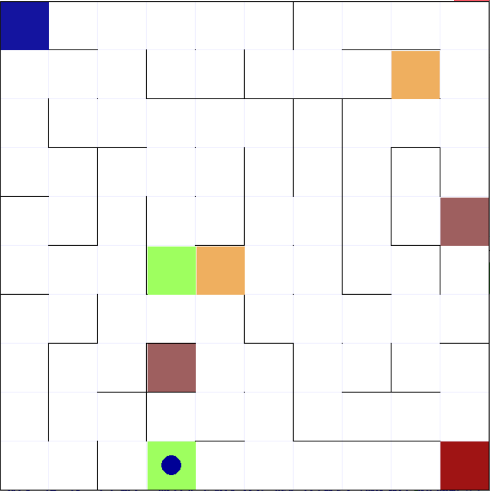

# Reinforcement Learning in a Maze Environment using Q-Learning 🤖 
Reinforcement Learning (RL) is a machine learning paradigm where an agent learns to make decisions by interacting with an environment. The agent receives feedback in the form of rewards or punishments based on the actions it takes. The goal of RL is for the agent to learn a policy, a strategy that maps states to actions, in order to maximize the cumulative reward over time.

In this project, we focus on RL in a maze environment using Q-Learning, a model-free and off-policy learning method.

## Q_Learning
Q-Learning is a model-free and off-policy reinforcement learning method. The agent learns by updating Q-values, which represent the expected cumulative rewards for state-action pairs. The Q-values are iteratively refined based on rewards obtained and the maximum expected rewards from subsequent states. 

The Q-Learning algorithm is derived from the Bellman equation, which expresses the relationship between the value of a state and the values of its successor states.

Q(S, A) = (1 - α) * Q(S, A) + α [R(S, A) + γ * max Q(S', A')]

This equation iteratively updates Q-values, where α is the learning rate, γ is the discount factor, and max Q(S', A') represents the maximum Q-value for the next state.

## Exploration & Exploitation
To develop an optimal policy, the agent needs to balance exploration and exploitation. Exploration involves trying new actions to discover their rewards, while exploitation focuses on selecting actions that yield the highest known rewards. Action selection strategies, such as ε-greedy, play a crucial role in achieving this balance.

## Environment Overview 🎮🌀
Here is a more concise summary of the environment's characteristics:

- Agent: The environment includes an agent, which is the entity responsible for navigating through the maze. The agent's task is to move from the starting cell to the target cell.

- Starting Cell ([0, 0]): The maze has a designated starting cell for the agent, denoted by coordinates [0, 0]. This is the initial position from which the agent begins its journey.

- Target Cell ([n, n]): There is a target cell in the maze that serves as the destination for the agent. The target cell is located at coordinates [n, n].

- Randomly Generated Walls: The maze environment is designed with randomly generated walls. In each execution, the walls are placed randomly within the maze. These walls create obstacles that the agent must navigate around.

- Portal Cells: The maze contains portal cells. When the agent enters a portal cell, it is instantly transported to another cell with the same color. This feature adds a dynamic aspect to the maze navigation.

  



🎯
The primary task within this environment is to guide the agent from the starting cell to the target cell while taking into account the presence of walls and utilizing portal cells to aid in navigation.

## How to Run
1. Clone the Repository:
```bash
https://github.com/SheidaAbedpour/Reinforcement-Learning-in-Random-Mazes.git
```
2. To use this environment, after downloading the [package](https://github.com/SheidaAbedpour/Reinforcement-Learning-in-Random-Mazes/blob/main/gym-maze.zip), open the terminal inside the downloaded folder and enter the following command:
```bash
python setup.py install
```
3. Install Dependencies
```bash
pip install -r requirements.txt
```
4. Run the `main.py` and feel free to experiment with different hyperparameter values.
- `NUM_EPISODES`: Number of episodes for training
- `epsilon`: Exploration-exploitation trade-off parameter
- `alpha`: Learning rate
- `gamma`: Discount factor
5. Results Visualization: Check for results using the matplotlib library, including plots of the number of steps and total rewards over episodes, a visualization of the Q-table, and actions in the maze.

